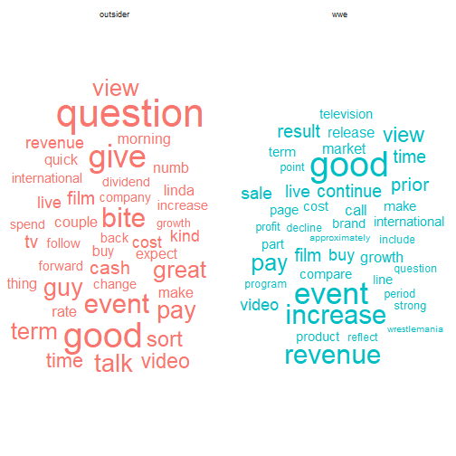
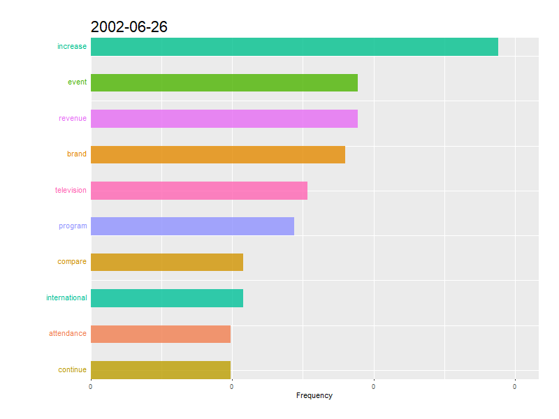
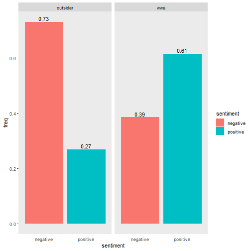
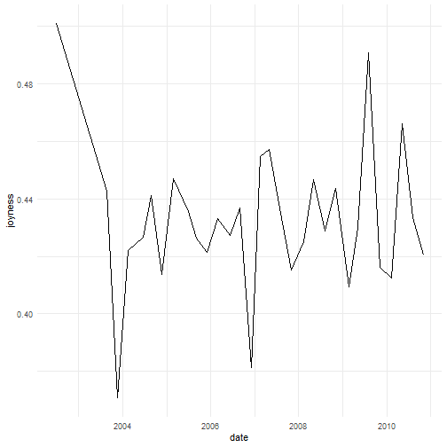
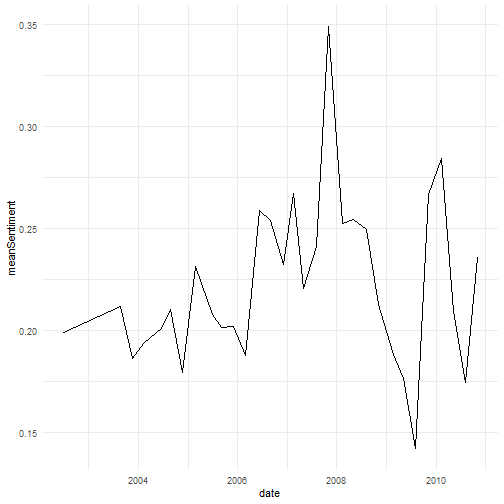
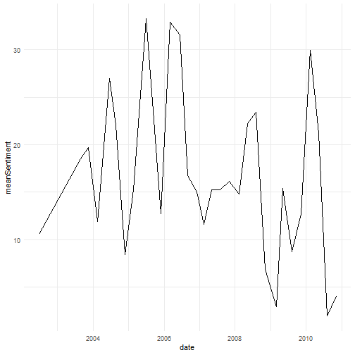
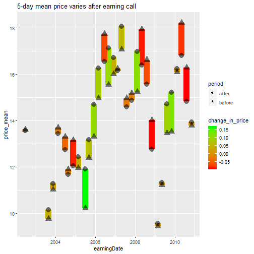
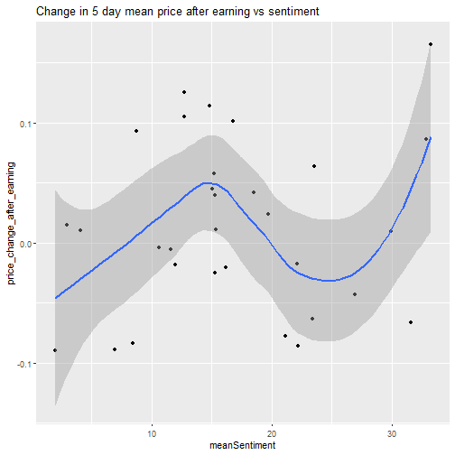
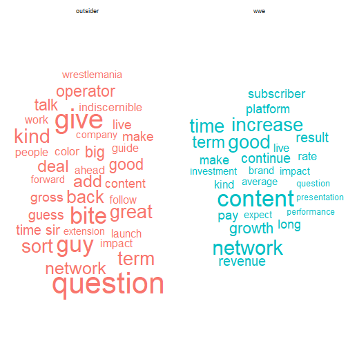

```r
library(tidyverse)
library(lubridate)
library(tm)
library(tidytext)
library(widyr)
library(wordcloud2)
library(textstem)
library(ggwordcloud)
library(gganimate)
library(doParallel)
library(lexicon)
library(textdata)
```

# The Data

The data is a Zip file containing WWE quarterly earning call transcripts from 2006 - 2010.


```r
wwedata <- unzip("wweCalls.zip")
```


# Step 1 - Data Cleaning and DEA

Read all of the parsed transcripts into R. Use the `list.files()` function and read files from the resultant object.</n>


```r
names <- list.files(path = ".", pattern = ".*parsed.*\\.csv$")
files <- lapply(names, read_csv)
allCalls <- dplyr::bind_rows(files)
```


## Cleaning

From some basic examination on the file, there are some data cleaning need to be done.  

### Invalid names, organization, and irrelavent person

1. Drop rows that the first name is India. Those records may have some parsing errors.  
2. What the operator say is not material.  
3. We want to break down the text by organization. There are some rows that have NAs for organization.  


```r
allCalls2 <- allCalls %>% 
  filter(name != "operator" & firstName != "India") %>% 
  select(-ticker) %>% 
  mutate(date = dmy(date), 
         title = as.factor(title), 
         organization = as.factor(organization)) %>% 
  drop_na(organization)
```

### Titles of each person
Simplify the titles base on organization(wwe vs. non_wwe)  


```r
allCall3 = allCalls2 %>% 
  mutate(role = ifelse(str_detect(organization, "W.*W.*E.*"), "wwe", "outsider")) %>% 
  mutate(role = as.factor(role)) %>% 
  select(role, text, date, quarter) %>% 
  mutate(text = str_replace_all(text, "\\(.*\\)", ""),
         text = tolower(text),
         text = lemmatize_strings(text),
         text = stripWhitespace(text),
         text = removeNumbers(text))
```

### Dates

```r
calldates = distinct(allCall3, date) %>% 
  arrange(desc(date))

rmarkdown::paged_table(calldates)
```

```
## Error in print.paged_df(x, ...): unused argument (options = options)
```
Earnings calls usually happen four times a year, but 2010 and 2009 have 5 calls. If we look at the transcript on 2010-11-30 and 2009-03-18, we can see they are actually not earnings calls. So, need to exclude them.


```r
allCall3 = allCall3 %>% 
  filter(date != ymd("2010-11-30") & date != ymd("2009-03-18"))
```


## Create a wordcloud using ggwordcloud

```r
mystopwords = c("quarter", "business", "wwe", "million", "year")

loughran_mcdonald_sw_df = data.frame(sw_loughran_mcdonald_long)
colnames(loughran_mcdonald_sw_df) = c("word")

tokens = allCall3 %>%
  unnest_tokens(word, text) %>%
  anti_join(loughran_mcdonald_sw_df) %>%
  filter(!(word %in% mystopwords)) %>% 
  group_by(role) %>%
  count(word) %>% 
  mutate(freq = n/sum(n)) %>% 
  top_n(n=40, wt = freq)
```

```
## Warning: Column `word` joining character vector and factor, coercing into character
## vector
```

```r
tokens %>% 
  ggplot(aes(label = word, size = freq,
             color = role))+
  geom_text_wordcloud_area()+
  scale_size_area(max_size = 15)+
  theme_minimal()+
  facet_wrap(~role)
```



## Top 10 earning call words over time


Animation code adopted from [stackoverflow](https://stackoverflow.com/questions/53162821/animated-sorted-bar-chart-with-bars-overtaking-each-other)


```r
tokens2 = allCall3 %>%
  unnest_tokens(word, text) %>%
  anti_join(stop_words) %>%
  filter(!(word %in% mystopwords))

callTf <- tokens2 %>% 
  group_by(date) %>%
  count(word) %>%
  mutate(freq = n/sum(n)) %>%
  # The * 1 makes it possible to have non-integer ranks while sliding
  mutate(rank = rank(-freq, ties.method = "first") * 1) %>%
  filter(rank<=10) %>% 
  mutate(times = as.character(date)) %>% 
  ungroup()
```


```r
p <- ggplot(callTf, aes(rank, group = word, 
                     fill = as.factor(word), color = as.factor(word))) +
  geom_tile(aes(y = freq/2,
                height = freq,
                width = 0.5), alpha = 0.8, color = NA) +

  # text in x-axis (requires clip = "off" in coord_*)
  # paste(country, " ")  is a hack to make pretty spacing, since hjust > 1 
  #   leads to weird artifacts in text spacing.
  geom_text(aes(y = 0, label = paste(word, " ")), vjust = 0.2, hjust = 1) +

  coord_flip(clip = "off", expand = FALSE) +
  scale_y_continuous(labels = scales::comma) +
  scale_x_reverse() +
  guides(color = FALSE, fill = FALSE) +

  labs(title='{closest_state}', x = "", y = "Frequency") +
  theme(plot.title = element_text(hjust = 0, size = 22),
        axis.ticks.y = element_blank(),  # These relate to the axes post-flip
        axis.text.y  = element_blank(),  # These relate to the axes post-flip
        plot.margin = margin(1,1,1,4, "cm")) +
  #facet_wrap(~role)+
  transition_states(times, transition_length = 5, state_length = 25) +
  ease_aes('quadratic-in-out')

animate(p, fps = 15, duration = 40, width = 800, height = 600)

#anim_save("wweWordFreq.gif", animation = last_animation(), path = "G:/My Drive/Mod3/Unstructure/HW1/")
```




# Step 2 - Sentiment Analysis


## Using Loughran and McDonald's lexicon

Find the positive and negative sentiment score for people from WWE and outside of WWE using Loughran and McDonald's lexicon. Loughran and McDonald's lexicon is created for use with financial documents. This lexicon labels words with six possible sentiments important in financial contexts: "negative", "positive", "litigious", "uncertainty", "constraining", or "superfluous". Here we only look at words that associate with positive and negative sentiments. The percentage of words with positive sentiment vs. words with negative sentiment is calculated for each organization group.


```r
lmEmotions <- get_sentiments(lexicon = "loughran")
tokens2 %>% 
  inner_join(lmEmotions) %>% 
  filter(sentiment == c("positive", "negative")) %>% 
  group_by(role) %>% 
  count(sentiment) %>% 
  mutate(freq = n/sum(n)) %>% 
  ggplot(aes(x = sentiment, y = freq, fill = sentiment)) +
    geom_bar(stat="identity")+
    geom_text(aes(label = round(freq,2)), vjust = -0.3)+
    facet_wrap(~role)+
    theme(panel.grid = element_blank(),
          axis.ticks.x = element_blank())
```



Overall, outsider used more negative words vs. positivie words. For people from WWE, it is reversed.

## Using nrc lexicon

</br>
NRC emotion includes 8 types of emotion in the dictionary. They are anger, anticipation, disgust, fear, joy, sadness, surprise, and trust. Here we only look at words associated with joy. And we further find the intensity of joy emotion for these words.

### How joyness change overtime

The graph show how average joyness in the earning calls change over time.

```r
tokens2 %>% 
  inner_join(hash_nrc_emotions, by = c("word"="token")) %>% 
  filter(emotion=="joy") %>% 
  inner_join(lexicon_nrc_eil(), by = c("word"="term")) %>% 
  filter(emotion == AffectDimension) %>% 
  group_by(date) %>% 
  summarise(joyness = mean(score)) %>% 
  ggplot(aes(x = date, y = joyness))+
    geom_line()+
    theme_minimal()
```



</br>
Based on the score associated with joy, it seems the joyness in the earning calls does not change too much. It generally ranges from 0.4 to 0.5, with 2 quarters below 0.4. However, the score below 0.5 means that the intensity of joy is not very high. There seems to be an slight upward trend since 2004.

### How does positivity change for each earning call?

The `sentiment()` function in sentimentr package is a handy and smart way to quickly find out the sentiment without tokenizing the text. Its valence_shifter feature can add more accuracy to the analysis.

```r
library(sentimentr)
library(lexicon)
library(magrittr)
sentiments = sentiment(get_sentences(allCall3), 
          polarity_dt = lexicon::hash_sentiment_nrc,
          valence_shifters_dt = lexicon::hash_valence_shifters) %>% 
  group_by(date) %>% 
  summarize(meanSentiment = mean(sentiment))

sentiments %>% 
  ggplot(aes(x= date, y = meanSentiment)) +
    geom_line()+
    theme_minimal()
```




</br>
The sentiment is not very positive in general. And it peaked in Q4 2007. The positivity is increasing until 2008, then it tanked. 


```r
sentiments2 = sentiment(get_sentences(allCall3), 
          polarity_dt = lexicon::hash_sentiment_loughran_mcdonald,
          valence_shifters_dt = lexicon::hash_valence_shifters) %>% 
  group_by(date) %>% 
  summarize(meanSentiment = sum(sentiment))

sentiments2 %>% 
  ggplot(aes(x= date, y = meanSentiment)) +
    geom_line()+
    theme_minimal()
```




# Step 3 - Impact of earning call to stock price

In this step, let's explore whether the sentiments of the earning calls have impact on WWE's stock price.  

The stock price history can be obtain from alphavantage's API.  
Register for a free API key from <a href"https://www.alphavantage.co/documentation/">alphavantage</a>. Using the API key, get the daily time series for the given ticker and explore the 10 trading days around each call's date (i.e., the closing price for 5 days before the call, the closing price for the day of the call, and the closing price for the 5 days after the call).  
Next, let's see if any visible patterns emerge when exploring the closing prices and the sentiment scores.  


```r
wweLink <- paste0("https://www.alphavantage.co/query?function=TIME_SERIES_DAILY&symbol=WWE&outputsize=full&datatype=csv&apikey=",apikey)

wwePrice <- read_csv(wweLink)
```


```r
earningDates <- allCall3 %>% 
  distinct(date)

prices <- wwePrice %>%
  mutate(date = ymd(timestamp))

earningRow <- which(prices$date %in% earningDates$date)

# this function is used to select indexes of the 10 day 
# records around earnings calls
selectRows <- function(x){
  indexes <- c()
  daysFromEarning <- c()
  group <- c()
  for(i in 1:length(x)){
    for(j in -5:5){
      indexes = append(indexes, x[i]+j)
      daysFromEarning = append(daysFromEarning, -j)
      group = append(group, i) # group is create to fill NAs in following step
    }
  }
  df = cbind(indexes, daysFromEarning, group)
  return (df)
}
rowsToKeep <- selectRows(earningRow)

aroundEarningP <- prices[rowsToKeep[,1],]
aroundEarningP <- aroundEarningP %>% 
  mutate(daysFromEarning = rowsToKeep[,2], group = rowsToKeep[,3]) %>% 
  select(date, close, daysFromEarning, group)

aroundEarningP2 <- allCall3 %>% 
  select(date, quarter) %>% 
  distinct(date, quarter) %>% 
  mutate(earningDate = date) %>% 
  right_join(aroundEarningP) %>% 
  left_join(sentiments2) %>% 
  group_by(group) %>% 
  fill(c(quarter,meanSentiment, earningDate), .direction = "updown") %>% 
  ungroup() %>% 
  mutate(year = year(date), 
         group = as.factor(group),
         period = if_else(daysFromEarning>0, "after", 
                          if_else(daysFromEarning == 0, "earning", "before"))) %>% 
  group_by(earningDate) %>% 
  mutate(pct_change = close/lead(close)-1) %>% # return calculation(useful but not used)
  ungroup()

# calculate the 5-day mean prices before and after earnings call
aroundEarningP3 <- aroundEarningP2 %>% 
  group_by(earningDate, period) %>% 
  mutate(price_mean = mean(close)) %>% 
  filter(period != "earning") %>% 
  distinct(earningDate, meanSentiment, price_mean) 

# pivot the tibble to draw the line segments in ggplot
aroundEarningP_p <- aroundEarningP3 %>% 
  pivot_wider(names_from = period, values_from = price_mean) %>% 
    mutate(change_in_price = after/before-1)

aroundEarningP_p %>% 
  ggplot(aes(x = earningDate))+
    geom_linerange(aes(ymin = before,ymax = after, color = change_in_price, size = 0.1))+
    scale_color_gradient(low = "red", high = "green")+
    geom_point(data = aroundEarningP3,
               aes(x = earningDate,
                   y = price_mean,
                   size = 0.1,
                   shape = period,
                   alpha = 0.5))+
    guides(size="none", alpha = "none")+
    labs(title = "5-day mean price varies after earning call")
```



In this chart, the 5-day mean price changes after earning calls. Sometimes it changes a lot, other times not so much. Sometimes it increases, sometimes decreases. Is the change correlated with earnings call sentiment?


```r
aroundEarningP_p %>% 
  mutate(price_change_after_earning = after/before-1) %>% 
  ggplot(aes(x = meanSentiment, y = price_change_after_earning))+
    geom_point()+
    geom_smooth()+
    labs(title = "Change in 5 day mean price after earning vs sentiment")
```



It looks 5-day mean price increase at sentiment score between 10-20. At 20-30 sentiment score, the mean price decreases. So, if someone is going to have a long position on WWE, a sentiment score of 10-20 is a good indicator. Even if the price decreses, it won't drop too much in the time period. This score interval has more upside potential.


# Step 4 - Parse Unstructured Earning Call Transcript

There are two calls within the zip file that are not parsed to a structural format. The following code is a way to parse unstructured transcripts to a more structured/tidy format.


```r
library(stringr)
raws <- lapply(list.files(path = ".", pattern = ".*raw.*\\.csv$"), read.csv)
```


```r
library(stringdist)
library(fuzzyjoin)
processRaw <- function(x){
  x <- rename(x, "mess"=1) %>% 
    mutate(mess = as.character(mess))
  symbol <- str_extract(x[1,], "(?<=NYSE\\:)[A-Z]*")
  quarter <- str_extract(x[2,], "Q\\d")
  year = str_extract(x[2,], "\\d{4}")
  earningDate = str_extract(x[3,], "[A-Za-z]*\\s\\d{1,2}\\,\\s\\d{4}") %>% 
    str_remove("\\,")
  executives = x %>% 
    slice(which(x$mess=="Executives")[1]:which(x$mess=="Analysts")[1]) %>% 
    slice(3:nrow(.)-1) %>% 
    mutate(mess = str_replace(mess,"\\– ", "\\-")) %>% 
    separate(mess, sep = "\\-", into = c("name", "title")) %>% 
    mutate(name = str_squish(name), title = str_squish(title)) %>% 
    mutate(organization = "WWE")
  
  analysts = x %>% 
    slice(which(x$mess=="Analysts")[1]:which(x$mess=="Operator")[1]) %>% 
    slice(3:nrow(.)-1) %>% 
    mutate(mess = str_replace(mess,"\\– ", "\\-")) %>% 
    separate(mess, sep = "\\-", into = c("name", "organization")) %>% 
    mutate(name = str_squish(name), organization = str_squish(organization)) %>% 
    mutate(title = "Analyst")
  
  people = dplyr::union(executives,analysts)
  
  transcript = x %>% 
    slice(which(x$mess=="Operator")[1]:nrow(.))
  transcript = mutate(transcript, mess = str_replace_all(mess,"\\– ", "\\'"))
  
  parsed <- transcript %>% 
    mutate(speakOrder = cumsum(str_detect(mess, regex("\\w$"))),
           name = if_else(str_detect(mess, regex("\\w$")), mess, NA_character_)) %>% 
    group_by(speakOrder) %>% 
    fill(name, .direction = "down") %>% 
    filter(mess != name) %>% 
    mutate(text = str_c(mess, collapse = " ")) %>% 
    ungroup() %>% 
    select(name, text) %>% 
    distinct() %>% 
    ## Inner join drops operator's records
    ## which is consistent with the methods in the first two sections
    ## change this to left_join for a complete parse
    ## fuzzy join to resolve a name discrepency between
    ## transcript and info above transcript
    ## maybe an overkill since there is only one name discrepency
    stringdist_inner_join(., people, by = "name", 
                          method = "jaccard",
                          q = 2,
                          distance_col = "distance",
                          max_dist = .5) %>% 
    mutate(symbol = symbol,
           year = year,
           quarter = quarter,
           date = mdy(earningDate),
           role = ifelse(str_detect(organization, "W.*W.*E.*"),
                         "wwe", "outsider"),
           role = as.factor(role))
  return (parsed)
}
```


```r
parsedRaws <- lapply(raws, processRaw)

newCalls = dplyr::bind_rows(parsedRaws) %>% 
  select(name.x,role, text, date, quarter) %>% 
  mutate(text = str_replace_all(text, "\\(.*\\)", ""),
         text = tolower(text),
         text = lemmatize_strings(text),
         text = stripWhitespace(text),
         text = removeNumbers(text)) 

rmarkdown::paged_table(newCalls)
```

```
## Error in print.paged_df(x, ...): unused argument (options = options)
```


```r
tokens = newCalls %>%
  unnest_tokens(word, text) %>%
  anti_join(loughran_mcdonald_sw_df) %>%
  filter(!(word %in% mystopwords)) %>% 
  group_by(role) %>%
  count(word) %>% 
  mutate(freq = n/sum(n)) %>% 
  top_n(n=25, wt = freq)

tokens %>% 
  ggplot(aes(label = word, size = freq,
             color = role))+
  geom_text_wordcloud_area()+
  scale_size_area(max_size = 15)+
  theme_minimal()+
  facet_wrap(~role)
```



Comparing the wordcloud from previous one, a big difference is that WWE's frequent word changes from "event" to "content" and "network".
